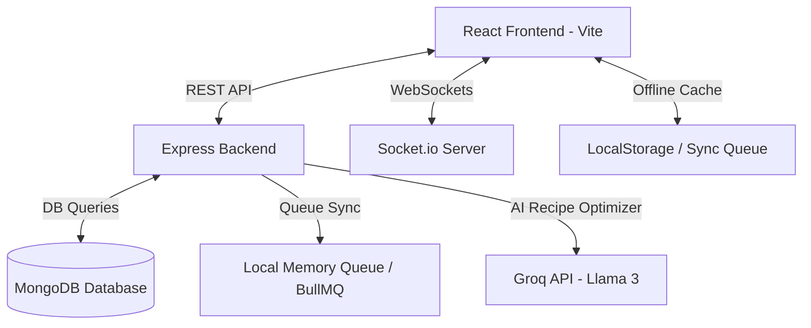

# EcoMeal: AI-Powered Kitchen Intelligence & Operating System

EcoMeal is a real-time, offline-first restaurant operating system designed to track inventory, minimize food waste, and automate kitchen intelligence. 

This repository contains the complete MERN-stack implementation (MongoDB, Express, React, Node.js) written in JavaScript.

---

## 🏗️ High-Level System Architecture



### Key Architectural Pillars
1. **Resilient Database Connectivity**: Built-in auto-retry database client prevents backend crashes if MongoDB is down temporarily.
2. **Indexed Database Lookups**: Database schemas configure compound and text indexes on critical search and filter parameters (`name`, `category`, `status`, `expiryDate`) to load and query 1000+ items rapidly.
3. **WebSockets Event Broadcasting**: WebSocket channels sync data mutations (Create/Update/Delete) to all active tabs/devices instantly.
4. **Offline-First Synchronization**: Mutating inventory changes while disconnected are queued locally and automatically processed in chronological order when a connection is re-established.
5. **Role-Based Security**: Access validation controls isolate operations (e.g., Only Admins/Kitchen Managers can modify stock, only Admins can delete).

---

## ⚡ Setup & Installation

### Prerequisites
- **Node.js** (v16+) installed.
- **MongoDB** running locally (usually on `mongodb://localhost:27017`) or a MongoDB Atlas connection string.

### 1. Configure Backend Environment
Navigate to the `backend/` folder, copy the template, and start installation:
```bash
cd backend
cp .env.template .env
```
Inside `.env`, verify your configurations:
```text
PORT=5001
MONGODB_URI=mongodb://localhost:27017/ecomeal
JWT_SECRET=some_strong_access_secret_key
JWT_REFRESH_SECRET=some_strong_refresh_secret_key
GROQ_API_KEY=gsk_your_groq_api_key_placeholder
```

### 2. Populate 1000+ Sample Items (Seeder)
Execute the database seeder from the `backend/` directory to insert 1050 ingredients:
```bash
npm run seed
```

### 3. Launch the Backend Server
Start the Express API & WebSocket server:
```bash
npm run dev
```
The server will boot on `http://localhost:5001`.

### 4. Launch the Frontend React Client
In a new terminal window, navigate to the `frontend/` directory, install packages, and start the Vite dev server:
```bash
cd frontend
npm install
npm run dev
```
Open your browser at the displayed local URL (typically `http://localhost:5173`).

---

## ⚙️ Offline-First & Failure Handling Logic

- **MongoDB Disconnection**: If the MongoDB server goes offline, the Node backend will automatically log the warnings and attempt reconnection every 5 seconds without crashing the server.
- **Client Offline**: If the user's internet drops:
  - The sidebar indicator changes to **Offline mode** with an alert banner.
  - Adding, editing, or deleting items updates the UI instantly (**optimistic updates**).
  - The exact operations are enqueued in `localStorage`.
  - When the browser goes back online, the `SyncQueue` processes the operations in order, maps temporary client IDs to actual database IDs, and refreshes the data.
- **Token Expiry**: If a session JWT expires during an operation, the Axios/Fetch interceptor automatically attempts to invoke `/api/auth/refresh-token` to acquire a new access token and retries the failed request seamlessly.
